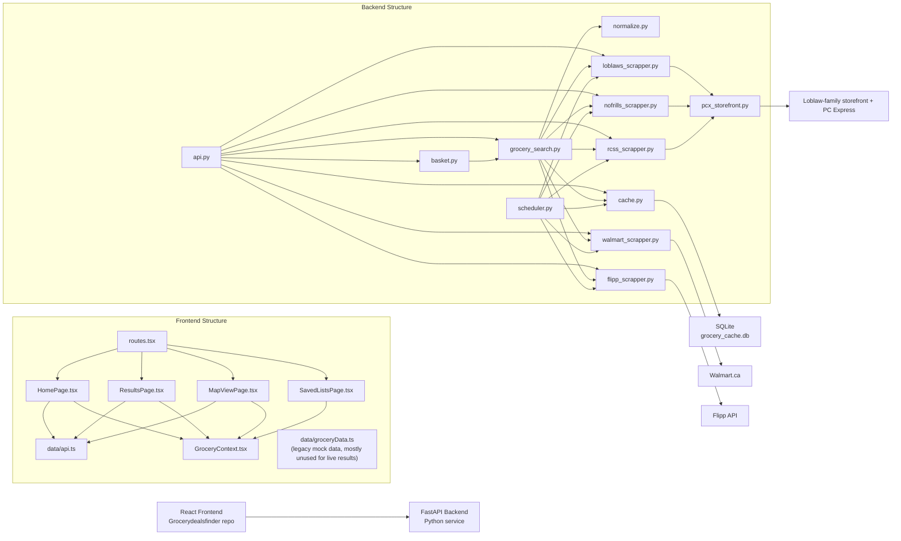

# Grocery Deals Finder Project Schema

## Architecture



## Frontend

- `src/app/routes.tsx`: browser routes
- `src/app/pages/HomePage.tsx`: budget, postal code, item entry, live suggestions from backend
- `src/app/pages/ResultsPage.tsx`: live basket comparison cards from `/basket`
- `src/app/pages/MapViewPage.tsx`: live store explorer page
- `src/app/pages/SavedListsPage.tsx`: saved list management and rerun flow
- `src/app/context/GroceryContext.tsx`: current list, saved lists, dark mode, persistence
- `src/app/data/api.ts`: typed fetch client for FastAPI
- `src/app/data/groceryData.ts`: old mock dataset still present, not the live source of truth anymore

## Backend

- `api.py`: FastAPI app
- `grocery_search.py`: combined multi-store search
- `basket.py`: basket comparison and store ranking
- `normalize.py`: unit price normalization
- `cache.py`: SQLite cache
- `scheduler.py`: background cache warmer
- `pcx_storefront.py`: shared non-browser request flow for Loblaw-family stores
- `walmart_scrapper.py`: Playwright-based Walmart scraper
- `loblaws_scrapper.py`: request-based Loblaws scraper
- `nofrills_scrapper.py`: request-based No Frills scraper
- `rcss_scrapper.py`: request-based RCSS scraper
- `flipp_scrapper.py`: flyer deal integration

## Request Flow

1. User enters budget, postal code, and items in `src/app/pages/HomePage.tsx`
2. Frontend stores items in `src/app/context/GroceryContext.tsx`
3. Frontend calls:
   - `/search` for suggestions
   - `/basket` for live comparison
4. `api.py` dispatches to `grocery_search.py` or `basket.py`
5. `grocery_search.py` checks `cache.py`
6. On cache miss, scrapers run sequentially
7. Results are normalized by `normalize.py`
8. Combined results return to FastAPI
9. Frontend renders live store comparison

## API Schema

All endpoints return:

```json
{
  "success": true,
  "data": {},
  "error": null
}
```

Endpoints:

- `GET /search?q={query}&postal_code={postal_code}`
- `GET /basket?items={item1},{item2}&postal_code={postal_code}`
- `GET /cache/status`
- `DELETE /cache/{query}?postal_code={postal_code}`
- `GET /health?postal_code={postal_code}`

## Search Response Schema

```python
{
    "query": str,
    "postal_code": str,
    "total": int,
    "sources": list[str],
    "failed": list[{"store": str, "error": str}],
    "cached": bool,
    "results": list[product],
}
```

## Normalized Product Schema

```python
{
    "store": str,
    "name": str,
    "brand": str | None,
    "price": float | None,
    "price_str": str | None,
    "was_price": str | None,
    "unit_price": str | None,
    "image": str | None,
    "link": str | None,
    "rating": float | None,
    "reviews": int | None,
    "source": str,
    "unit_price_normalized": float | None,
    "unit_price_unit": str | None,
}
```

Flipp adds:

```python
{
    "valid_until": str | None
}
```

## Basket Response Schema

```python
{
    "items": list[str],
    "postal_code": str,
    "total_stores": int,
    "stores": [
        {
            "store": str,
            "total_cost": float,
            "total_cost_str": str,
            "available_items": list[str],
            "missing_items": list[str],
            "breakdown": [
                {
                    "item": str,
                    "name": str | None,
                    "price": float | None,
                    "price_str": str | None,
                    "unit_price": str | None,
                    "store": str,
                    "link": str | None,
                    "source": str,
                }
            ],
            "available_count": int,
            "missing_count": int,
        }
    ],
    "searches": {
        "milk": {
            "total": int,
            "sources": list[str],
            "failed": list[{"store": str, "error": str}],
            "cached": bool,
        }
    }
}
```

## Cache Schema

SQLite DB:

- `grocery_cache.db`

Table:

```sql
cache(
  query TEXT NOT NULL,
  store TEXT NOT NULL,
  results TEXT NOT NULL,
  timestamp REAL NOT NULL,
  PRIMARY KEY (query, store)
)
```

Effective cache key behavior:

- query is normalized with postal code in `cache.py`
- this prevents cross-region cache contamination

## Loblaw-Family Scraper Flow

1. `pcx_storefront.py` loads storefront homepage
2. Extracts Next.js `buildId`
3. Loads storefront `/_next/data/{buildId}/en.json`
4. Chooses store ID from regional defaults or pickup-location fallback
5. Creates a cart via PC Express BFF
6. Calls storefront `/_next/data/{buildId}/en/search.json`
7. Parses `productTiles`
8. Filters sponsored items
9. Returns normalized products

## Scheduler Flow

- `scheduler.py` warms cache on startup
- refresh terms every 55 minutes

Terms:

- beef
- chicken
- milk
- eggs
- bread
- pork
- salmon
- cheese
- butter
- pasta

## Current Live Data Status

- `Loblaws`: working
- `No Frills`: working
- `Real Canadian Superstore`: working
- `Flipp`: working
- `Walmart`: currently failing because the search selector no longer matches Walmart’s current page

## Frontend State Schema

Context currently stores:

```ts
{
  currentList: string[],
  savedLists: SavedGroceryList[],
  isDarkMode: boolean
}
```

Saved list shape:

```ts
{
  id: string,
  name: string,
  items: string[],
  createdAt: string,
  lastUsed?: string
}
```

## Run Instructions

Backend:

```bash
cd /path/to/backend
source ./grocery-env/bin/activate
uvicorn api:app --app-dir . --host 127.0.0.1 --port 8000 --reload
```

Frontend:

```bash
cd /path/to/Grocerydealsfinder
npm run dev
```
